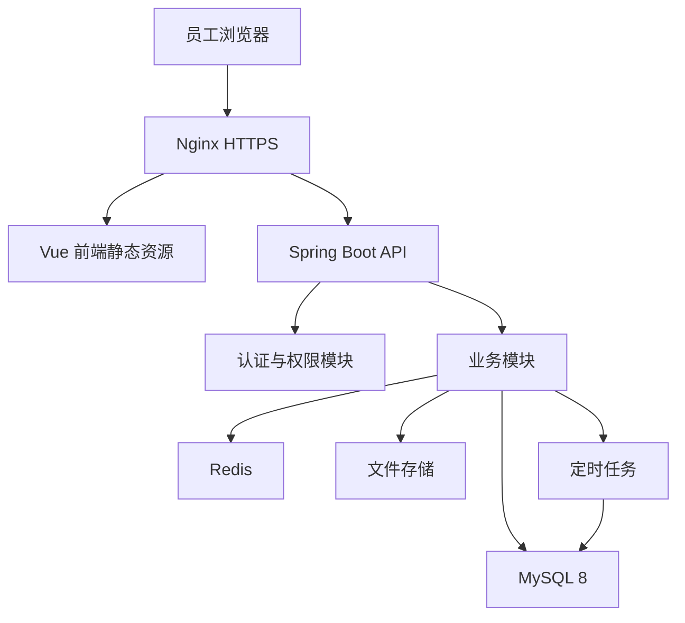

# 电商内部 ERP 技术架构文档

## 1. 架构目标

系统采用 Java + Vue + TypeScript + Tailwind CSS + MySQL 8 的模块化单体架构，优先保证开发效率、数据一致性、部署简单和后续可扩展。当前规模为 20 人以内、单仓库、多平台数据导入，不需要微服务复杂度。

## 2. 技术栈

| 层级 | 推荐技术 | 说明 |
| --- | --- | --- |
| 前端 | Vue 3、TypeScript、Vite、Tailwind CSS | 适合后台管理系统，样式可控，便于沉淀内部组件 |
| 后端 | Java 21、Spring Boot 3、Spring Security、MyBatis Plus | 适合企业内部系统，团队招聘和维护成本可控 |
| 数据库 | MySQL 8 | 国内 Java 团队常见，部署维护简单 |
| 缓存 | Redis | 用于登录会话、验证码、导入进度、短期缓存 |
| 文件存储 | 本地磁盘或对象存储 | 保存导入文件、导出文件、单据附件 |
| 部署 | Nginx、Docker Compose | 单机云服务器部署，方便备份和迁移 |
| 文档 | Markdown、OpenAPI | 需求、架构、接口、数据库设计持续维护 |

## 3. 总体架构



## 4. 模块化单体设计

后端部署为一个 Spring Boot 应用，内部按业务模块分包。模块之间通过 Service 接口调用，不直接跨模块操作数据库表。

建议包结构：

```text
com.company.erp
  common          通用响应、异常、工具、枚举、审计字段
  system          用户、角色、权限、菜单、登录
  masterdata      客户、供应商、员工、仓库、分类
  product         产品、SKU、物料、BOM、成本计算
  inventory       库存余额、库存流水、库存调整
  purchase        采购单、采购入库、应付生成
  assembly        组装入库、物料扣减、成品入库
  sales           线下销售单、出库、应收生成
  finance         应收、应付、收付款、费用、经营流水
  platform        平台导入、导入模板、导入批次、平台销售数据
  dashboard       经营总览、库存预警、平台汇总
  attendance      班次、排班、考勤记录
```

## 5. 前端架构

前端采用 Vue 3 + TypeScript 单页后台系统，使用 Tailwind CSS 作为主要样式方案。页面按业务模块划分，公共组件集中维护。

建议目录：

```text
src/
  api/            后端接口封装
  components/     通用组件，例如表格、表单、弹窗、状态标签
  layouts/        后台布局、菜单、顶部栏
  router/         路由和权限守卫
  stores/         Pinia 状态
  views/          业务页面
  styles/         Tailwind 入口样式和少量全局样式
  utils/          时间、金额、导入导出、权限工具
```

前端页面以表格、筛选、表单、详情抽屉、确认弹窗为主，避免复杂视觉设计。后台系统优先保证录入效率、查询效率和错误提示清晰。Tailwind CSS 用于布局、间距、颜色和响应式样式；高频业务控件应封装为内部组件，避免页面内重复堆叠大量样式类。

## 6. 认证与权限

目标生产方案：

- 正式员工使用企业飞书身份，临时员工使用手机号 + 密码。
- Spring Security 统一处理登录认证、接口鉴权和登录态解析。
- MySQL 存储 OAuth state、一次性票据、登录会话和审计，安全值只保存哈希。
- 权限模型为用户、角色、权限。
- 权限控制分为菜单权限和操作权限。
- 后端接口必须校验权限，前端隐藏菜单只作为体验优化。
- 成本、利润、财务类接口默认只允许老板/管理员和财务角色访问。

当前开发阶段实现：

- 已实现密码登录、飞书 OAuth、退出、当前用户、持久会话和登录审计接口。
- 通用迁移不创建默认账号；仅 `local/test` Profile 可显式初始化本地临时管理员，短信登录已移除。
- 前端令牌当前保存在浏览器 `localStorage`，key 为 `bebefish_access_token`。
- 登录页以飞书扫码为正式员工主入口，临时员工密码登录为次入口。

## 7. 数据一致性策略

库存、财务和单据状态必须由后端事务统一保证。

- 单据确认必须在数据库事务中完成。
- 销售确认：检查库存、扣减库存、写库存流水、生成应收/收款。
- 采购确认：增加库存、写库存流水、生成应付。
- 组装确认：检查物料库存、扣物料、加成品、写库存流水、记录成本。
- 作废确认单据时，必须生成反向库存流水和反向财务记录，不直接删除历史流水。
- 库存余额表用于快速查询，库存流水表用于追溯和审计。

## 8. 导入导出架构

平台数据和考勤数据第一版通过 Excel/CSV 导入。

导入流程：

1. 上传文件并保存导入批次。
2. 根据平台或业务类型选择字段映射。
3. 逐行解析并校验。
4. 成功数据落业务表，失败数据记录错误原因。
5. 返回成功条数、失败条数、失败文件下载地址。

导出流程：

1. 前端提交筛选条件。
2. 后端按权限和筛选条件生成文件。
3. 文件保存到临时目录或对象存储。
4. 返回下载地址并记录导出日志。

## 9. 部署架构

第一版推荐单台云服务器 Docker Compose 部署：

```text
nginx
erp-web
erp-api
mysql
redis
backup-job
```

建议配置：

- 2 核 4G 云服务器可支持第一版试运行。
- 正式使用建议 4 核 8G，独立数据盘。
- Nginx 负责 HTTPS、静态资源、API 反向代理。
- MySQL 数据目录挂载独立磁盘。
- 上传文件目录独立挂载并纳入备份。

## 10. 备份与恢复

- MySQL 每天凌晨自动备份一次。
- 备份文件保留 30 天。
- 每周至少一次将备份同步到服务器外部位置。
- 上传文件和导入原始文件纳入备份。
- 恢复演练按月执行一次，确认备份可用。

## 11. 安全策略

- 全站启用 HTTPS。
- 密码使用强哈希存储，不保存明文密码。
- 登录失败次数过多时短时间锁定账号。
- 所有写操作记录操作人、操作时间和来源 IP。
- 文件上传限制后缀、大小和 MIME 类型。
- 导入文件解析不执行公式和宏，只读取单元格结果。
- 生产环境关闭调试接口和详细异常堆栈。

## 12. 性能与扩展

当前系统规模较小，优先使用 MySQL 索引和分页查询解决性能问题。后续扩展路线：

- 多仓库：启用 warehouse_id 维度。
- 扫码：基于 SKU、物料条码字段扩展扫码页面。
- 平台 API：在 platform 模块增加授权、定时同步、同步日志。
- 审批流：在单据状态前增加提交和审核状态。
- 微服务：只有当团队、单量、平台同步规模明显扩大后再考虑拆分。
